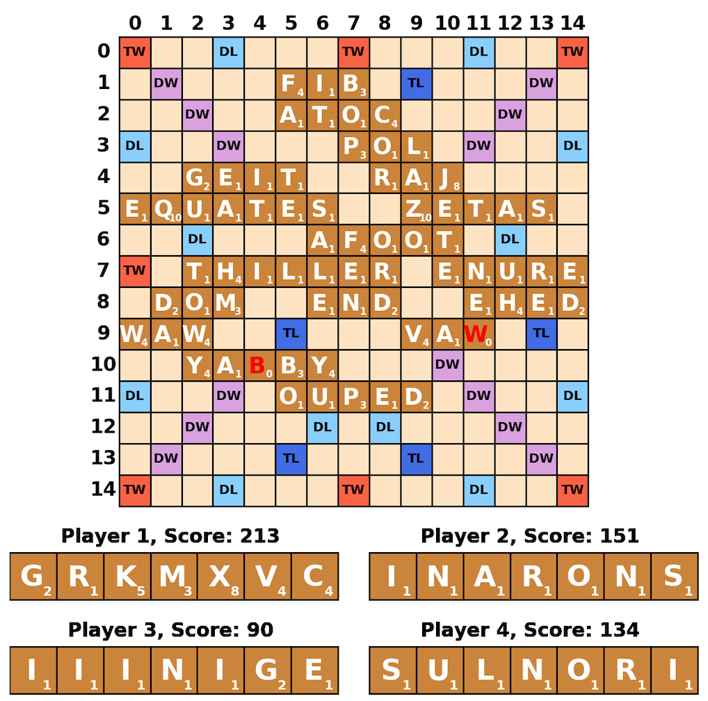

# Scrabble with Python


This project allows Scrabble play through the command line and with a Matplotlib board graphic. The game can be played by 1-4 people, with the option of making CPU players. The CPU players will play the highest scoring word possible given their tile rack.

To start a game, run:
```
python game.py
```

The flag `--players 4` will determine number of players in the game (1-4). `--CPU 2` will determine number of CPU players.


<!--  -->